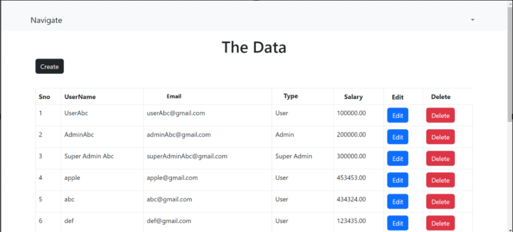

# Welcome to Employee Login

This application provides employees with an efficient and secure way to manage their work-related tasks and information. Whether you're registering for the first time or logging in to access your dashboard, we're here to help you every step of the way.

## Features

- **Secure login and registration**: Ensure that only authorized personnel can access the system.
- **Easy access to personal information and work schedules**: Quickly view and update your personal details and work timetable.
- **Real-time notifications and updates**: Stay informed about important changes and announcements instantly.
- **Comprehensive reporting and analytics**: Generate detailed reports and analyze work performance and metrics.
- **Role-based access control**: Differentiate access levels between User, Admin, and SuperAdmin to maintain security and proper information flow.

## Getting Started

Follow these instructions to get a copy of the project up and running on your local machine for development and testing purposes.

### Installation

1. **Clone the repository:**
   ```sh
   git clone https://github.com/akshayasbipin/app-crud--draft.git

   <table>
  <tr>
    <td></td>
    <td></td>
  </tr>
  <tr>
    <td></td>
    <td></td>
  </tr>
</table>

